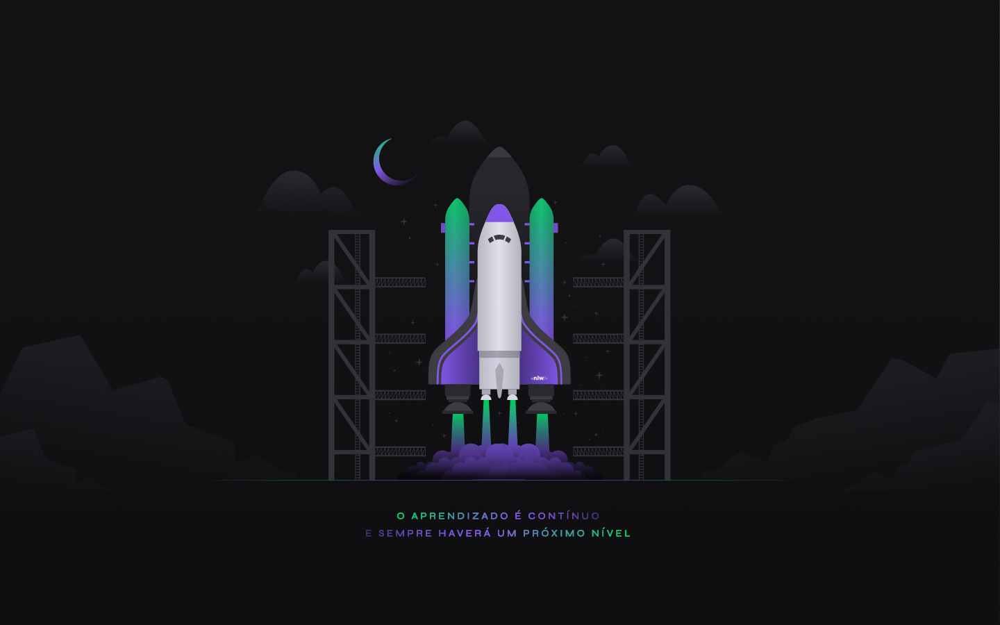
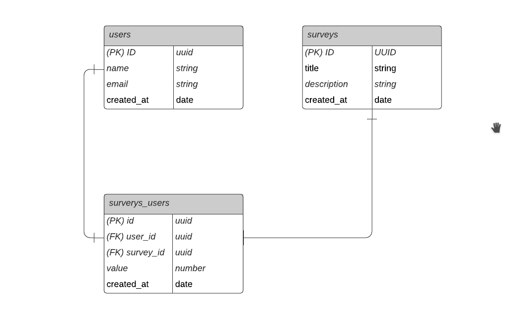

<center><h1 >NLW04 - NodeJS</h1></center>



<br/>
<br />

<p align="center">
  <a href="#-sobre"> Sobre </a>&nbsp;&nbsp;&nbsp;|&nbsp;&nbsp;&nbsp;
  <a href="#-material-de-apoio">Material de apoio</a>&nbsp;&nbsp;&nbsp;|&nbsp;&nbsp;&nbsp;
    <a href="#-material-de-apoio">Diagrama</a>&nbsp;&nbsp;&nbsp;|&nbsp;&nbsp;&nbsp;
    <a href="#-como-baixar">Como baixar</a>

# 🔖 Sobre

Esse projeto foi desenvolvido durante a trilha de NodeJS, na quarta edição da NLW.
Aprendemos conceitos sobre o que é um API, como iniciar um projeto utilizando Typescript e Express para gerenciamento das rotas, TypeORM para manipulação dos dados, testes automatizados e envio de e-mail.

---

## 🗂 Material de apoio

- [Typescript](https://www.typescriptlang.org/)
- [Ethereal-Email](https://ethereal.email/)
- [TyeORM](https://typeorm.io/#/)
- [Express](https://expressjs.com/pt-br/)
- [Jest](https://jestjs.io/)
- [SQL Editor Beekeeper Studio](https://www.beekeeperstudio.io/)

---

## 🔶 Diagrama

</img>

---

## 👍🏻 Como baixar

```bash

    // Clonar repositório
    $ git clone https://github.com/rocketseat-education/nlw04-nodejs.git

    // Acessar diretório
    $ cd nlw04-nodejs

    // Instalar dependências
    $ yarn

    // Iniciar projeto
    $ yarn start
```

---
